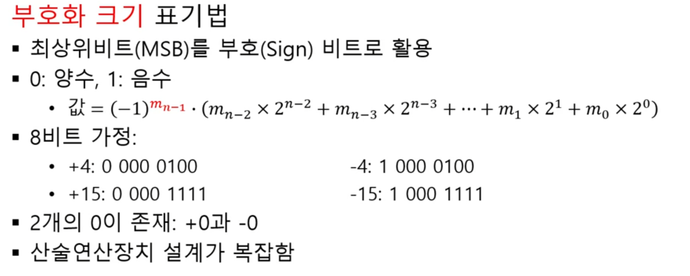
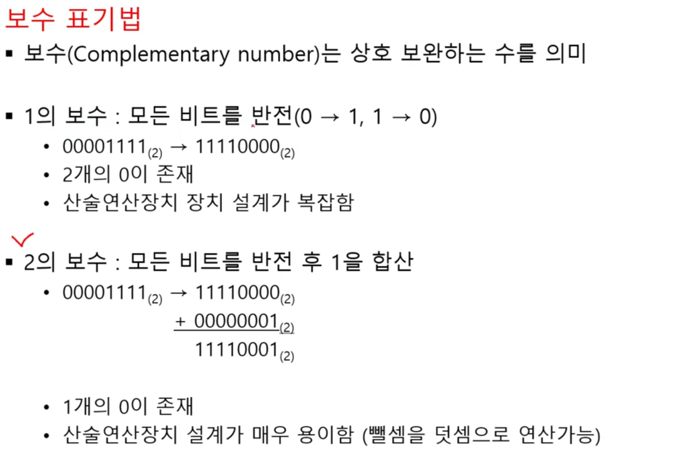
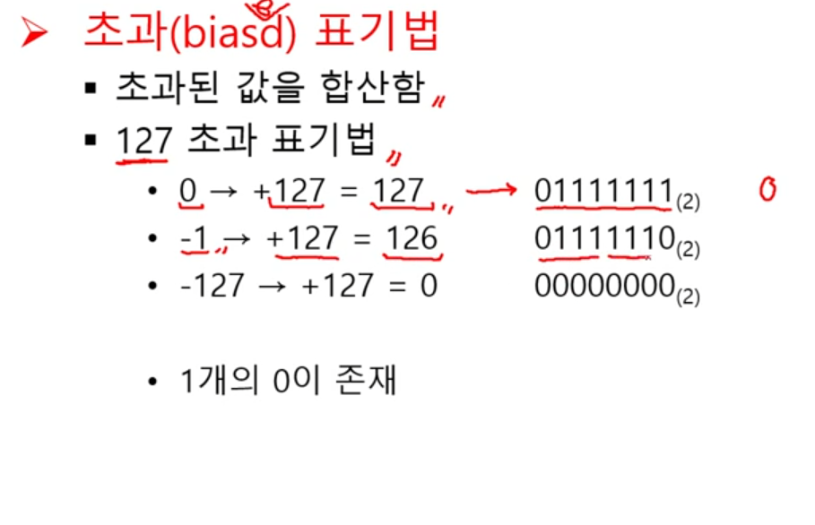
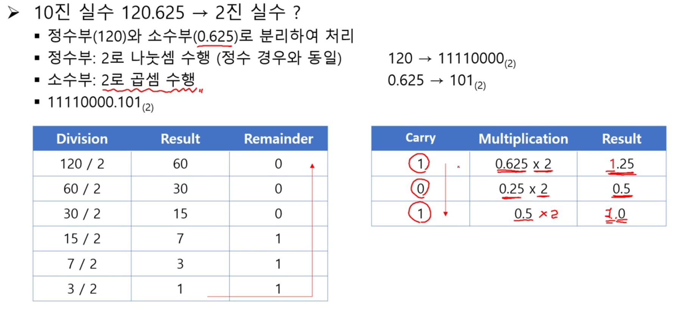
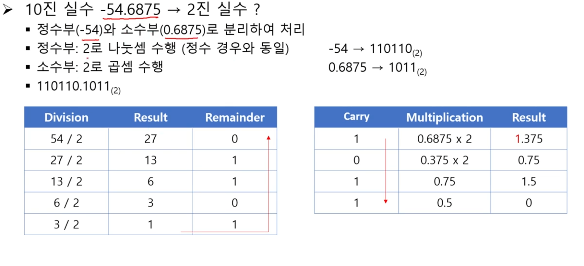
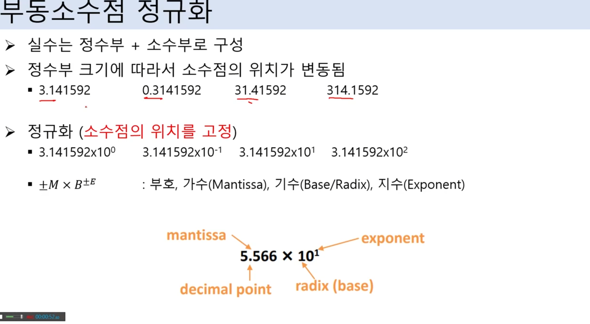
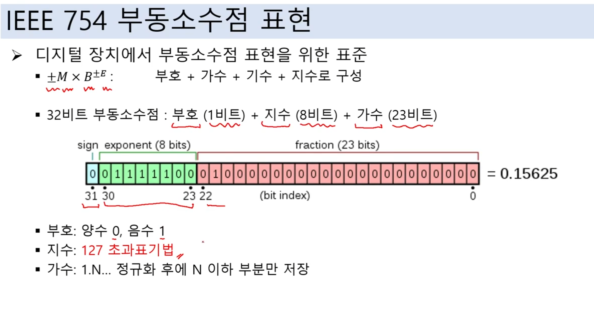
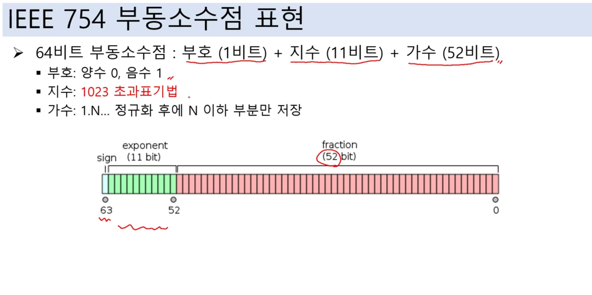

# 데이터표현2

## 음수 표현
- 부호-절댓값(Sign-Magnitude): 가장 왼쪽 비트를 부호 비트로 사용, 부호 비트가 0이면 양수, 1이면 음수를 의미 ex: '10000001'은 -1
- 2의 보수: 음수는 해당 양수의 2의 보수로 표현
- 부호화 크기 표기법 - 미사용
- 보수 표기법 - 정수의 음수 표현
- 초과 표기법 - 부동소수점의 음수 표현

 

## 부호화 크기 표기법

 

## 보수 표기법

 

## 초과 표기법

 

## 10진 실수를 2진 실수로 변환

 

## 부동소수점 정규화
- 소수점의 위치를 고정

 

## IEEE 754 부동소수점 표현

