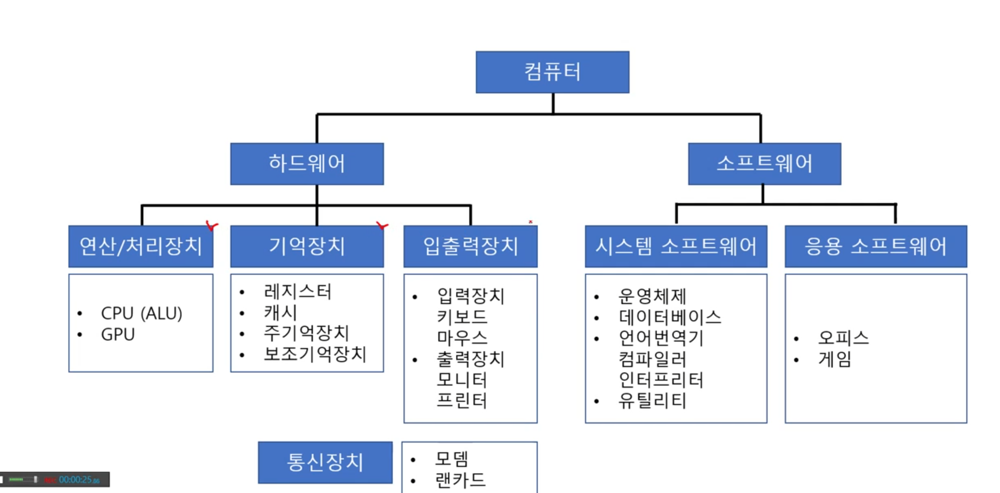
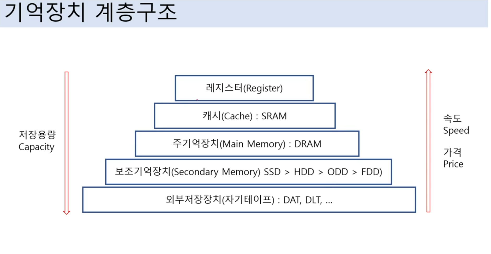
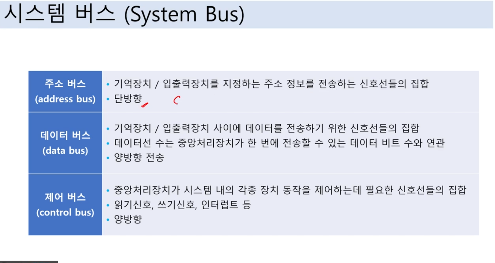
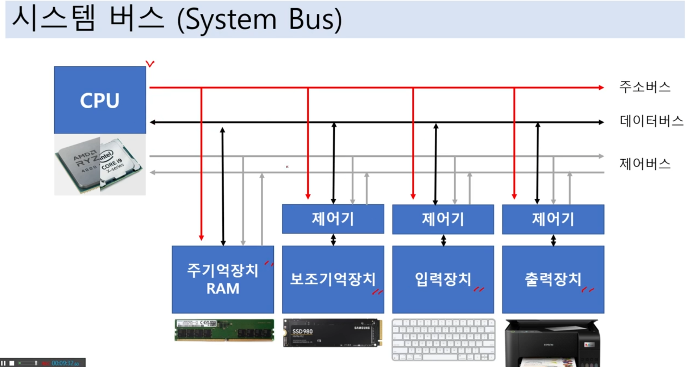

# 컴퓨터구조 개요

 

## 컴퓨터 구성 요소

## 중앙처리장치(CPU)
- CPU는 Central Processing Unit의 약자로 컴퓨터의 중앙 처리 장치
- 컴퓨터의 '두뇌'와 같은 역할, 컴퓨터가 수행하는 모든 작업과 계산을 제어

1. 명령어 처리 : CPU는 저장된 프로그램의 명령어를 순차적으로 읽어들여 처리합니다. 기본적인 작동 원리인 '페치(Fetch) - 디코드(Decode) - 실행(Execute)' 사이클
2. 연산 수행 : 산술 논리 연산 장치(ALU)라는 부분을 통해 다양한 산술 연산과 논리 연산을 수행합니다.
3. 제어 : 제어 유닛이라는 부분을 통해 컴퓨터의 다른 부분들과 통신 및 제어를 담당
4. 캐시 메모리 관리 : CPU는 캐시라는 고속 메모리를 가지고 있어, 자주 사용하는 데이터나 명령어를 빠르게 접근할 수 있음

 

## 기억장치
### 주기억 장치
- 컴퓨터에서 직접 접근할 수 있는 메모리, CPU가 직접 접근하여 데이터를 읽고 쓸 수 있음
- RAM과 ROM이 포함
- RAM: 일시적으로 데이터를 저장하는 메모리, 컴퓨터가 작동하는 동안에만 정보를 보관, 컴퓨터가 종료되면 RAM에 저장된 모든 정본느 사라짐. 휘발성 메모리
- ROM: 읽기 전용 메모리, 컴퓨터가 부팅될 때 필요한 정보를 저장, 컴퓨터가 종료되어도 유지, 일반적으로 사용자가 변경 할 수 없음

 

### 보조기억 장치
- 데이터를 영구적으로 저장하는 메모리, 컴퓨터가 작동하지 않을 때도 정보를 유지, 하드디스크, SSD, CD, DVD 등이 포함
- 하드 디스크: 하드 디스크는 대용량의 데이터를 저장할 수 있는 비휘발성 저장 장치, 데이터를 자기 디스크에 저장, 디스크의 회전 속도에 따라 데이터 접근 속도 결정
- SSD: SSD는 플래시 메미로 기반의 저장 장치, 전원이 꺼져도 데이터를 유지, SSD는 물리적인 부품히 없어 하드 디스크보다 더 빠른 속도를 제공

 

## 입출력장치
1. 입력 장치
2. 출력 장치

 

## 통신 장치
- 컴퓨터나 다른 기기 간에 데이터를 전송하거나 받는 역할을 하는 장치
- 네트워크를 통해 데이터를 교환, 서로 다른 위치에 있는 기기들 사이의 통신을 가능하게함
1. 모뎀: 디지털 신호를 아날로그 신호로 변환, 아날로그 신호를 디지털 신호로 변환
2. 라우터: 여러 개의 네트워크를 연결, 데이터 패킷이 목적지까지 가장 효율적인 경로로 전송되도록 하는 장치

 

## 시스템 버스
- 컴퓨터 내부의 다양한 구성 요소들이 정보를 교환할 수 있도록 하는 데이터 경로
1. 데이터 버스: 실제 데이터를 전송하는 경로, 데이터 버스의 너비(bit 수)는 한 번에 전송할 수 있는 데이터의 양을 결정
2. 주소 버스: 메모리의 어느 위치에 데이터를 읽거나 쓸 것인지를 지정하는데 사용되는 경로, 주소 버스의 너비는 컴퓨터가 접근할 수 있는 메모리의 크기를 결정
3. 제어 버스: CPU가 메모리 또는 입출력 장치에게 어떤 동작을 수행해야 하는지를 지시하는데 사용되는 경로

 

