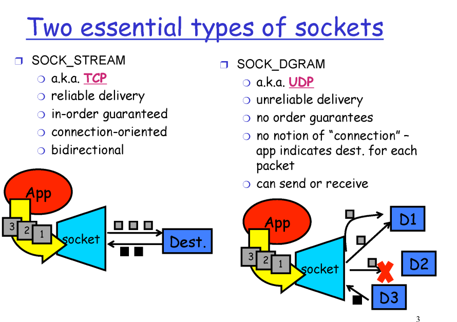
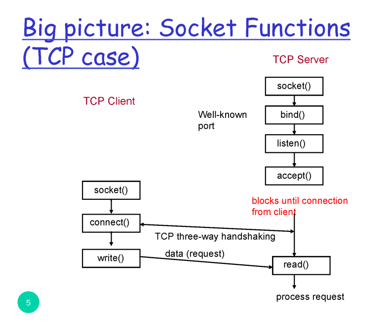
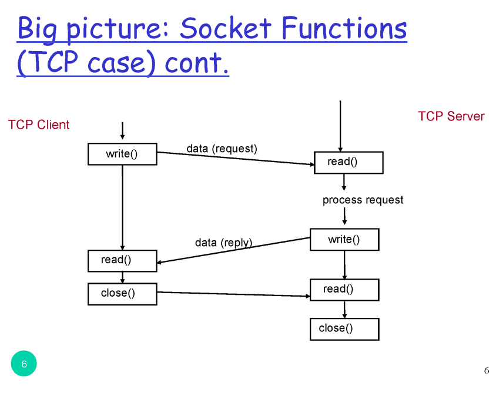
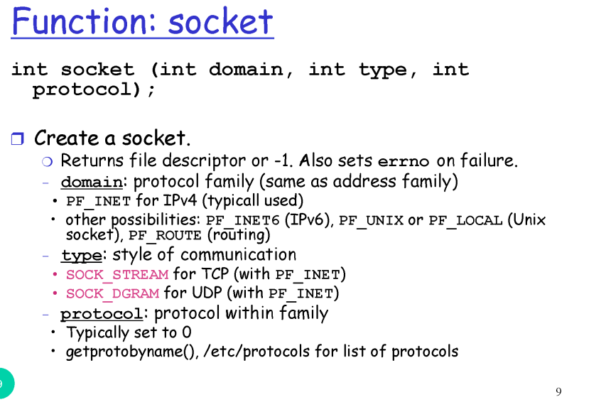
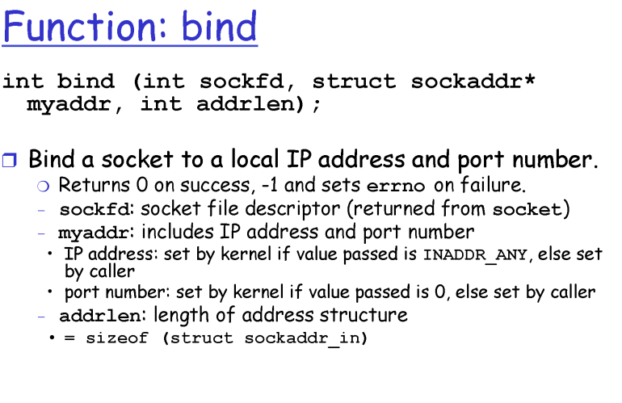
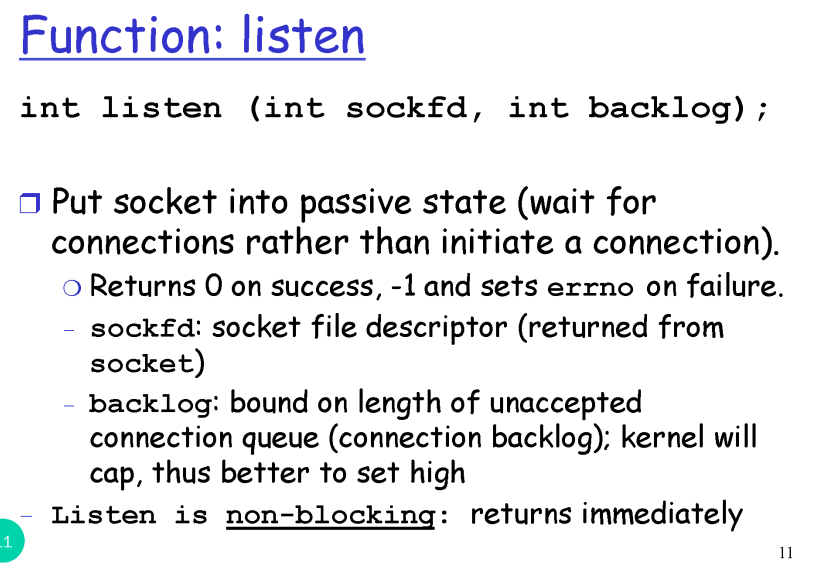
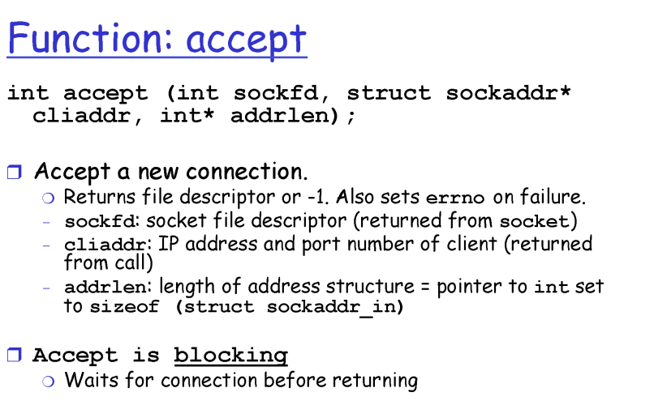
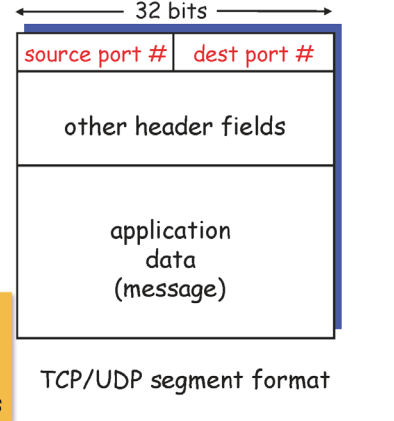
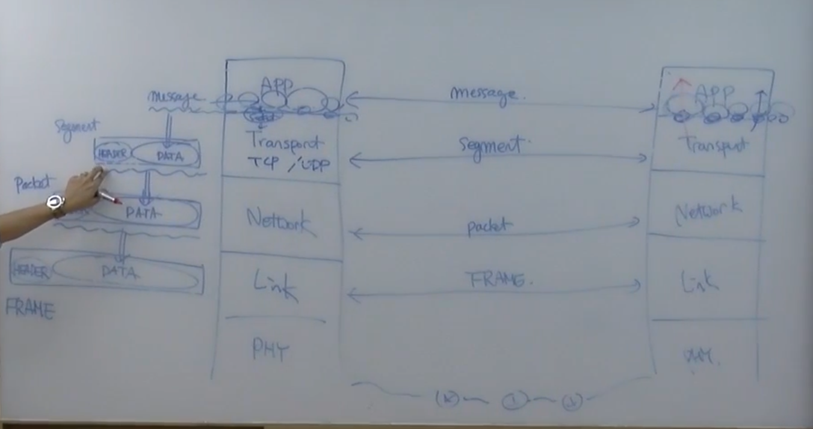
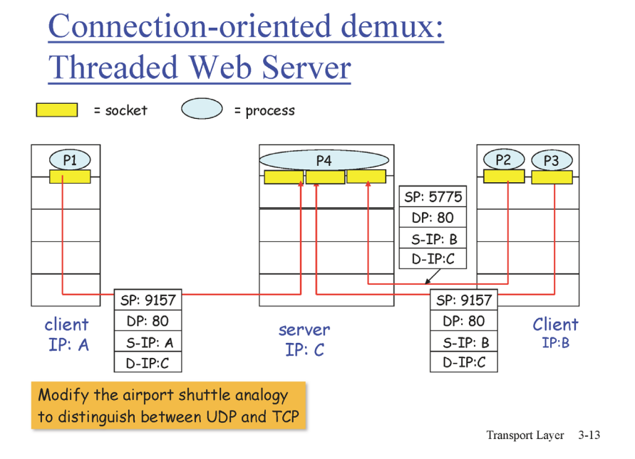

# 애플리케이션계층1
## Socket
- TCP
- UDP

 

## Function: socket
- 가장 중요 2번째 소켓: TCP냐 UDP냐

 

## Function: bind
- 방금 생성한 socket의 IP
- 특정 포트에 바인드 하겠다

 

## Function: listen
- 방금 생성한 socket을 리슨할 것이다
- 최대 몇 개까지 queue에 담아놓고 처리하겠다

 

## Function: accept
- 다 생성했으니 기다리겠다
- 두번째 파라미터 중요(ip와 주소)

 

## Multiplexing/demultiplexing
- 애플리케이션 계층에서 내려오면 하나의 세그먼트를 만들고 그 후에 내린다
- 멀티로 들어오는 것을 하나로 만들어서 내려보내기 -> 멀티플렉싱
- 데이터를 꺼내서 알맞은 애들한테 데이터를 올려 보내기 -> 디멀티플렉싱
- 헤더로 정보를 판단 (source port, dest port)
- UDP는 dest port, dest IP로 디멀티플렉싱
- TCP는 src IP, src port, dst IP, dst port로 디멀티플렉싱 하나라도 다르면 다른 곳으로 감
- TCP 각각의 소켓을 하기 위해 자원을 많이 소모

## UDP: User Datagram Protocol
- 헤더에 4개
- 체크섬: 에러가 있는지 없는지 체크
- 멀티플렉싱, 디멀티플렉싱, 에러 유무