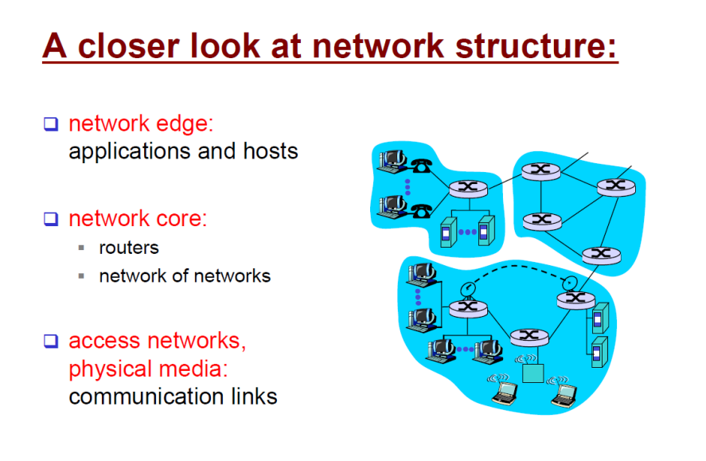
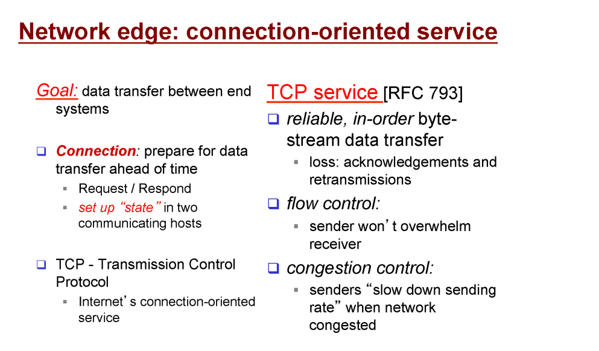
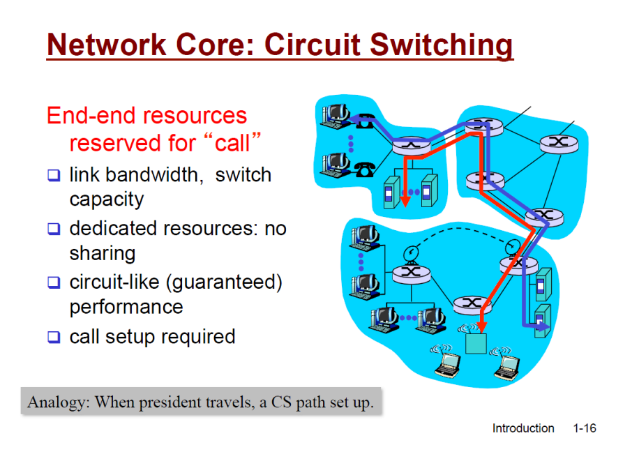
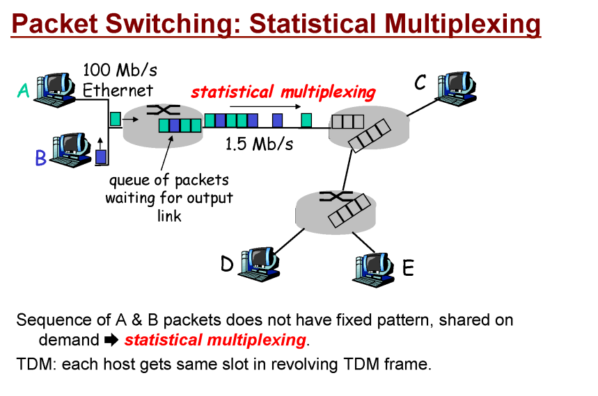
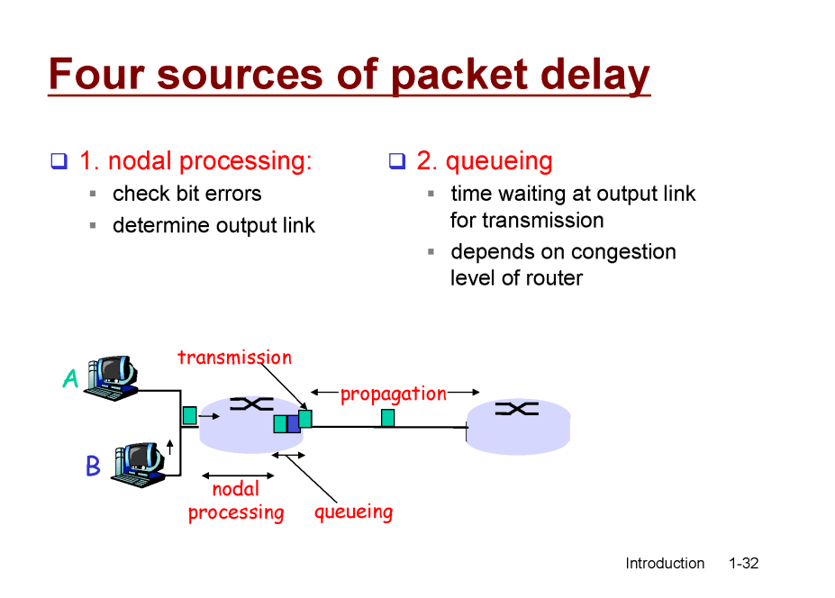
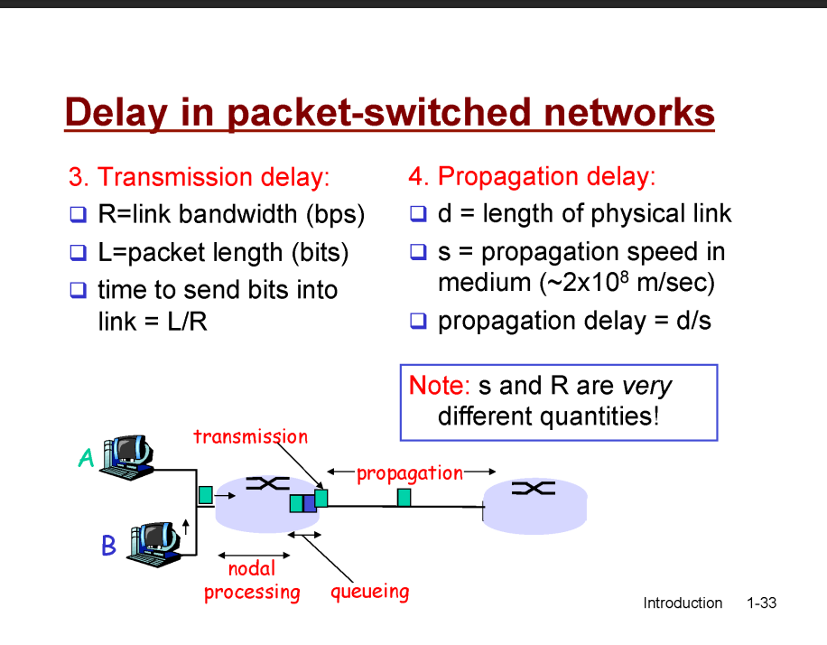

# 컴퓨터 네크워크 기본1

## 네트워크 구성요소
- 네크워크 엣지 : 앱, 브라우저
- 네트워크 코어 : 라우터
- 연결 해주는 링크

 

## connection-oriented service
- TCP service
1. 신뢰성, 데이터 순서
2. flow control - 리시버의 수준, 속도에 맞게
3. congestion control - 상황에 맞게(?)

- UDP
1. connectionless
2. unreliable data transfer
3. no flow control
4. no congestion control

 

## 프로토콜(protocol)
- 규약

## 네트워크 코어(Network Core)
- circuit switching: 출발지부터 목적지까지 정해놓은 유저의 길을 만들어놓은

 

- packet-switching:

 

## packet delay
1. nodal processing: 프로레싱 하는 동안 생기는 딜레이, 많은 사람들이 몰렸을 때
2. queueing: queue에 저장된 순서대로 나가기 때문에 생기는 딜레이(패킷 유실)
3. Transmission delay: 비트가 나가기 시작한 순간부터 끝까지 나갈 때까지 걸리는 딜레이
4. Propagation delay: 마지막 비트가 나가서 도달할 때까지 걸리는 딜레이

 