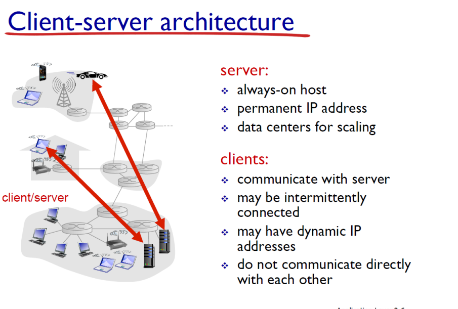
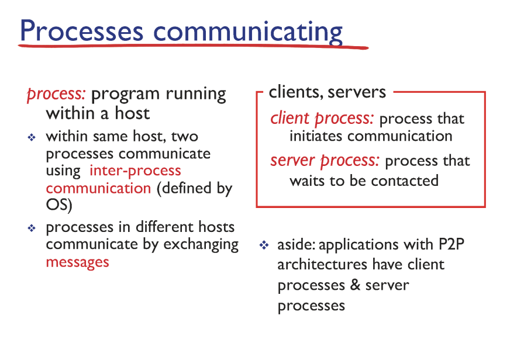
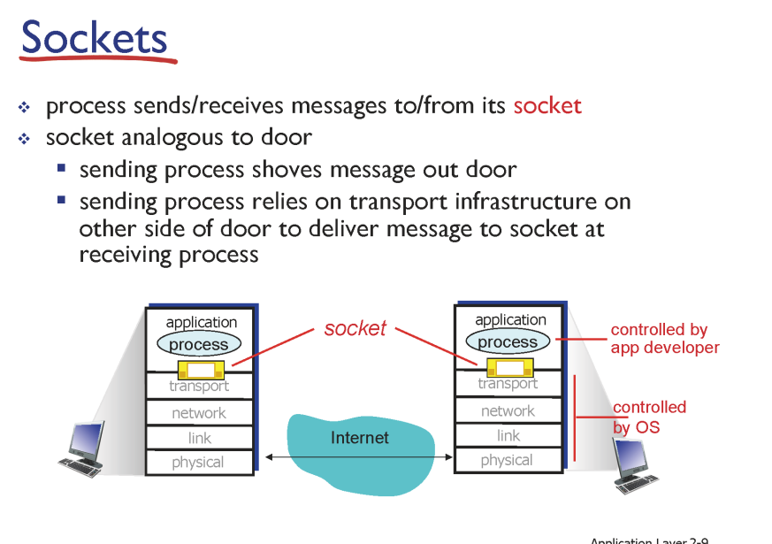
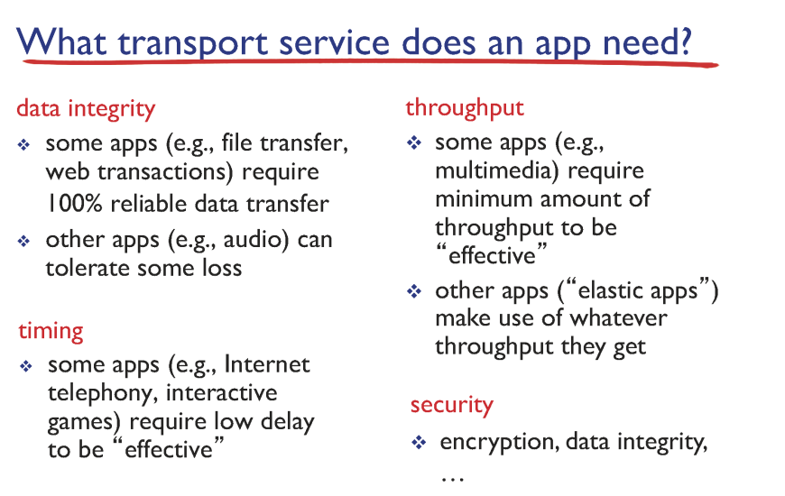
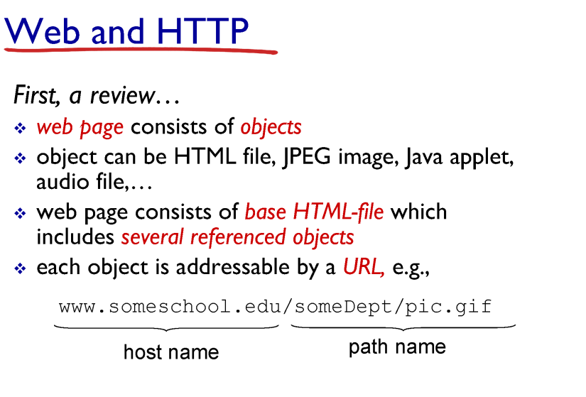
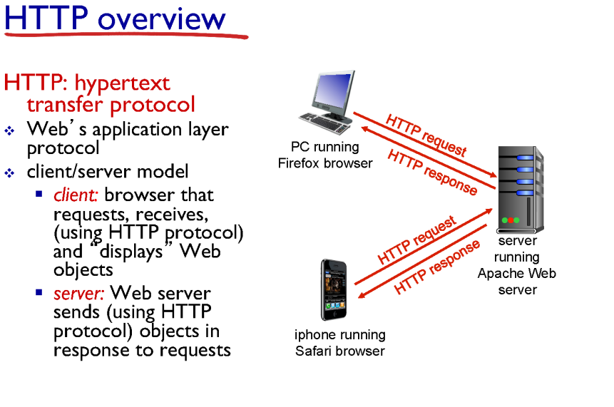
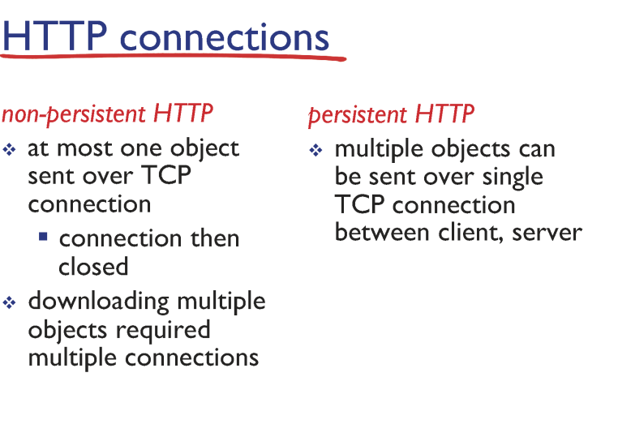
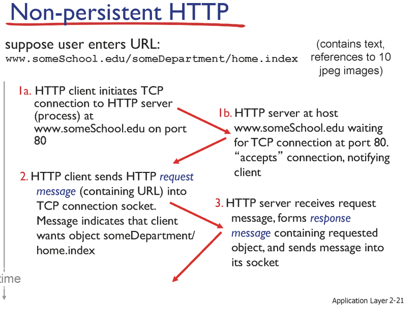
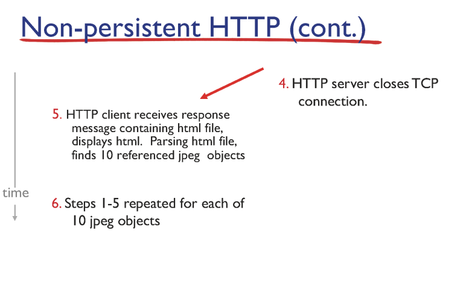
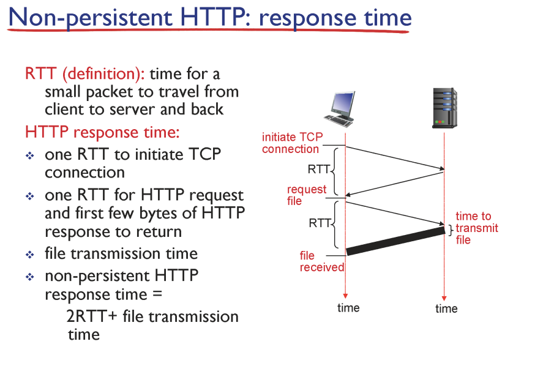

# 컴퓨터 네크워크 기본2

## APP(HTTP) 프로그램
- 프로세스

## Client-Server
- server : 고정된 자기 주소를 가지고 있어야함 (ip주소)
- client : 서버랑 통신

 

## IP주소, port
- IP 주소: 프로세스 주소
- PORT: 웹 소켓에 해당하는 특정 주소(?)
- 왜 공통 포트(80번)을 쓸까?: 서버는 24시간, 주소가 일정, ip주소만 다르게 포트까지 다르면 너무 많음, 헷갈림

 

## transport 계층에서 app 계층에 주는 기능
- **data integrity: 데이터 유실 x -> 제공**
- timing: 시간의 희망사항(시간)
- throughpuht: 통신의 희망사항(양)
- security: 안전

 

## HTTP(HyperText Tranfer Protocol)
- request
- response
- TCP 사용
- 상태가 없음(기억하지 않음)
- TCP 사용 종류에 따라 2가지
  - non_persistent HTTP: 통신을 끊으면
  - persistent HTTP: 통신을 끊지 않고 유지하면서 계속 사용

 

 

## Non-persistent HTTP
